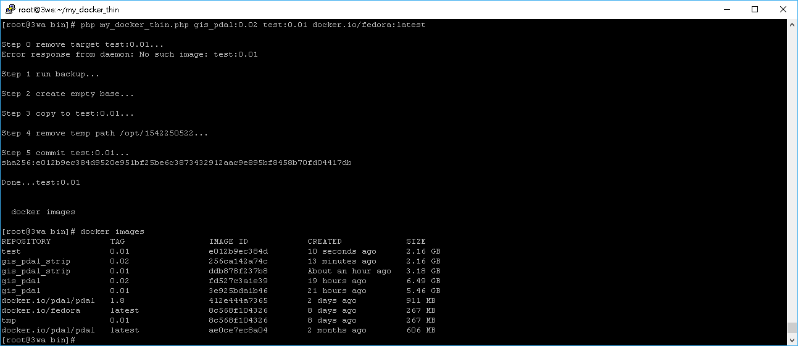

# my_docker_thin
我的 docker 映像檔廋身機 linux 版專用

要求： 
　　linux 環境 　　
 
動機： 
　　　　好不容易把 docker 的環境作出來，但容量也因為太多步驟過程變超肥，又懶的去作dockerfile，這時只要用這支小程式跑一次，把需要東西獨立抽出來瘦身。
　　會複製原本映像檔裡的 etc、usr、var，如果有其他需要備份的目錄再加。 
    
　　請自行先把映像檔的 /usr/bin、/usr/local/bin、/usr/lib、/usr/lib64 的內容 strip，並commit，包出來的環境才會又瘦又小 
    
   　　strip `find /usr/lib` 
   　　strip `find /usr/bin` 
   　　... 
   
使用方式： 
　　./my_docker_thin.sh [Source] [Target] [Base] 
　　php my_docker_thin.php [Source] [Target] [Base] 
   
　　例如： 
　　　　./my_docker_thin.sh myimage:0.01 myimage_release:0.01 docker.io/fedora:latest 
　　或 PHP 版：         
　　　　php my_docker_thin.php myimage:0.01 myimage_release:0.01 docker.io/fedora:latest 
 
縮圖參考： 
　　   
   
